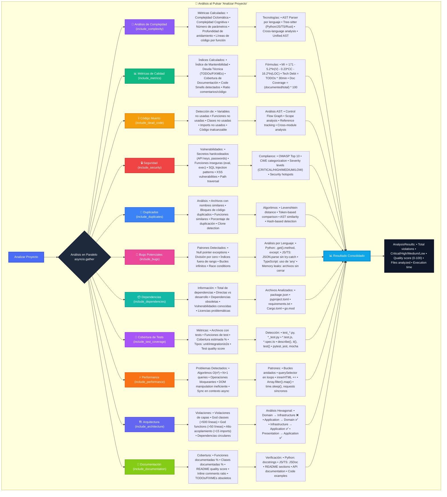

# 🔍 Diagrama Completo de Análisis - CodeAnt Agent

Este diagrama muestra todos los análisis que se ejecutan cuando se pulsa el botón "Analizar Proyecto" en el dashboard.



## 📋 Resumen de Análisis Implementados

### Análisis Originales (5)
1. **🔧 Complejidad** - Análisis AST multi-lenguaje con métricas avanzadas
2. **📊 Métricas de Calidad** - Índice de mantenibilidad y deuda técnica
3. **💀 Código Muerto** - Detección de código no utilizado con Tree-sitter
4. **🔒 Seguridad** - Escaneo de vulnerabilidades y OWASP compliance
5. **📑 Duplicados** - Detección de código duplicado

### Nuevos Análisis Implementados (6)
6. **🐛 Bugs Potenciales** - Detección proactiva de errores comunes
7. **📦 Dependencias** - Análisis de vulnerabilidades y obsolescencia
8. **🧪 Cobertura de Tests** - Evaluación de la calidad de testing
9. **⚡ Performance** - Detección de problemas de rendimiento
10. **🏗️ Arquitectura** - Verificación de arquitectura hexagonal
11. **📝 Documentación** - Análisis de calidad de documentación

## 🔄 Flujo de Ejecución

1. **Usuario** pulsa "Analizar Proyecto" en el dashboard
2. **Frontend** envía POST a `/api/analysis/run`
3. **Backend** ejecuta todos los análisis en paralelo usando `asyncio.gather()`
4. **Cada análisis** procesa los archivos según su especialidad
5. **Resultados** se consolidan en `AnalysisResults`
6. **Dashboard** muestra los resultados actualizados

## 📊 Métricas Finales

El sistema calcula un **Quality Score** global basado en:
- Número de violaciones por severidad
- Densidad de problemas por archivo
- Cobertura de tests y documentación
- Cumplimiento de mejores prácticas

```
Quality Score = 100 - (weighted_violations / files_analyzed * 10)
```

Donde las violaciones se ponderan:
- Critical: 10 puntos
- High: 5 puntos
- Medium: 2 puntos
- Low: 1 punto
